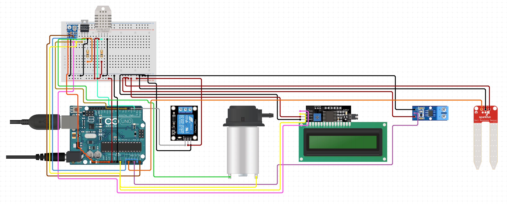

# ASCIS – Arduino-Based Sensor-Controlled Irrigation System

An Arduino Uno–based irrigation controller for small and medium-sized farms. Sensor readings (soil moisture, air temperature, humidity) decide when a relay switches a water pump on or off, so crops are watered only when needed.

Built as the group minor project for **Analog Circuits (UES301)**, Electrical Engineering, Thapar Institute of Engineering & Technology (TIET), Patiala — July–December 2024.

<p align="center">
  
</p>

## How it works

1. A soil moisture sensor measures how dry the soil is; a DHT22/DHT11 measures air temperature and humidity. The report also describes a BMP180 barometric pressure sensor for weather-aware decisions.
2. The Arduino Uno (ATmega328P) reads the sensors and decides whether irrigation is needed.
3. A relay module switches the DC pump, giving galvanic isolation between the Arduino and the load.
4. An I2C LCD shows the live sensor values.
5. A 12 V supply powers the system; an LM2596 buck converter steps it down to 5 V for the logic side.

## Hardware

| Component | Role |
|---|---|
| Arduino Uno R3 (ATmega328P) | Main controller |
| Soil moisture sensor | Soil moisture level |
| DHT22 / DHT11 | Air temperature and humidity |
| BMP180 | Barometric pressure (weather prediction) |
| I2C LCD | Displays sensor readings |
| Relay module | Switches the pump; isolates control from load |
| DC pump | Draws water from the source |
| LM2596 buck converter | 12 V → 5 V step-down |
| L7805CV | Fixed 5 V linear regulator |
| Current sensor module, MOSFET | Shown in the circuit diagram (optional in the firmware) |
| 12 V DC supply | Power (solar is suggested as an option) |
| 100 µF capacitors, resistors, jumper wires, breadboard | Supporting parts |

## Repository layout

```
.
├── README.md
├── docs/
│   ├── ASCIS_Project_Report_submitted.pdf # report as submitted
│   └── images/
│       └── circuit-diagram.png
└── firmware/
    ├── README.md                                 # libraries, pin map, calibration, serial commands
    └── ASCIS/
        ├── ASCIS.ino                             # main sketch
        └── config.h                              # pins, thresholds, options
```

## Team

Rachit Saini, Debojeet Dutta, Yatin Jha, Meitreya Priyadarshi

## Report

Firmware setup and tuning: [`firmware/README.md`](firmware/README.md)

Full write-up (introduction, objectives, circuit diagram, working principle, results, applications, references): [`docs/ASCIS_Project_Report.docx`](docs/ASCIS_Project_Report.pdf)
